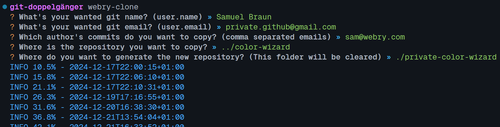

# @webry/clone

A simple tool to clone a repository in an anonymous way while keeping commits
and file changes intact. Files and code are randomly generated and no real data
is copied.

## Install

```bash
deno install -g --allow-run="git" -E -R -W -n webry-clone jsr:@webry/clone
```
or
```bash
deno install --global --allow-run="git" --allow-env --allow-read --allow-write --name webry-clone jsr:@webry/clone
```

## Usage

```bash
webry-clone
```

Example:

