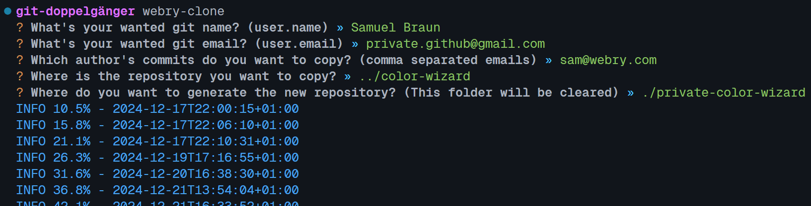

<!-- Generated by readmer from .readmer/readme.json. Edit the JSON, then run `readmer`. -->
<div align="center">

# @webry/clone

_A deno cli to clone a repo anonymously while preserving commit & file type statistics. 👥_

</div>

&nbsp;

## Why does this exist?
Work done in private/GitLab repos never shows on GitHub; this mirrors the statistics without leaking a single line of real code.

## What it does

Files and code are randomly generated and no real data is copied.

## How to install it

```bash
deno install --global --allow-run="git" --allow-env --allow-read --allow-write --name webry-clone jsr:@webry/clone
```

## How to use it

```bash
webry-clone -f ./from-gitlab-repo -t ./to-github-repo
```

## How it looks


